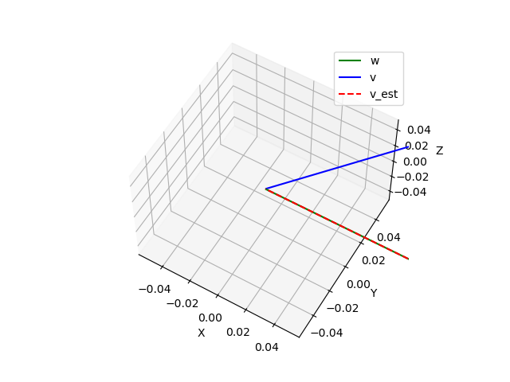

# q-method  
q-method is a robust attitude estimation method.  
it estimates quaternion to minimize Wahba's loss function.  

Wahba's loss function

minimize J(R) = Σ[||R**v**ᵢ - **w**ᵢ||²], for i = 1, 2, ..., n

## how to use 
```
python script/qmethod.py
```

```
--r0--
[0.         0.         0.42261826 0.90630779]
[50.  0.  0.]
[[ 0.64278761 -0.76604444  0.        ]
 [ 0.76604444  0.64278761  0.        ]
 [ 0.          0.          1.        ]]
w
[[1.]
 [0.]
 [0.]]
v
[[0.64278761]
 [0.76604444]
 [0.        ]]
--q--
[-0.90630779 -0.42261826 -0.          0.        ]
--r1--
[-0.42261826 -0.          0.         -0.90630779]
[ 0.  0. 50.]
--r2--
[-0.90630779 -0.42261826 -0.          0.        ]
[-50.   0. 180.]
```



# Reference  
・	人工衛星の力学と制御ハンドブック，姿勢制御研究委員会（編）  
